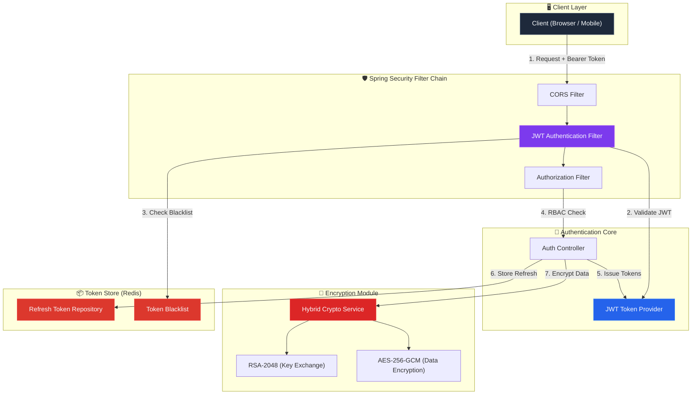

<div align="center">


<h3>🔐 Enterprise-grade Security: JWT Refresh Token Rotation, RSA-AES Hybrid Encryption</h3>

<p>
  
  
  
  
</p>

<p>
  
  
  
</p>

</div>

---

> 금융 및 엔터프라이즈 급 보안 표준을 준수하는 **인증(Authentication) & 암호화(Encryption)** 아키텍처 레퍼런스입니다.  
> 단순한 구현을 넘어, **왜 이 기술을 선택했는지(ADR)**와 **어떻게 동작하는지(실행 증거)**를 투명하게 공개합니다.

---

## 📌 Problem — 왜 만들었는가
- **토큰 탈취 취약점**: 단순 JWT Access Token 발급 방식은 토큰 탈취 시 서버에서 통제할 수 없는 치명적 단점이 존재합니다.
- **민감 데이터 전송의 한계**: HTTPS에만 의존하기엔 엔드포인트 탈취나 프록시 스니핑 위험이 있어, 애플리케이션 레벨의 추가 암호화(E2EE)가 필요합니다.
- **이 프로젝트는** Redis 기반의 Refresh Token Rotation(RTR)과 RSA-AES 하이브리드 암호화를 통해 이 문제들을 엔터프라이즈급으로 해결합니다.

## 🏗️ Architecture — 어떻게 설계했는가


*(자세한 아키텍처 구조는 [`docs/architecture.md`](./docs/architecture.md) 참조)*

---

## 📂 Project Structure

```
security-auth-core/
├── .github/workflows/ci.yml          # GitHub Actions CI 파이프라인
├── src/
│   ├── main/
│   │   ├── java/com/hooney/lab/
│   │   │   ├── SecurityAuthCoreApplication.java   # 메인 엔트리 포인트
│   │   │   ├── config/
│   │   │   │   └── SecurityConfig.java            # 🛡️ Spring Security 필터 체인
│   │   │   └── security/
│   │   │       ├── jwt/
│   │   │       │   ├── JwtTokenProvider.java       # 🔑 토큰 생성/검증/파싱
│   │   │       │   ├── JwtAuthenticationFilter.java # 🛡️ JWT 인증 필터
│   │   │       │   └── JwtProperties.java          # ⚙️ JWT 설정 바인딩
│   │   │       ├── crypto/
│   │   │       │   ├── HybridCryptoService.java    # 🔐 RSA+AES 하이브리드 암호화
│   │   │       │   └── CryptoProperties.java       # ⚙️ 암호화 설정 바인딩
│   │   │       └── redis/
│   │   │           ├── RefreshTokenRepository.java  # 📦 Refresh Token 저장소
│   │   │           └── RedisTokenBlacklist.java     # 🚫 토큰 블랙리스트
│   │   └── resources/
│   │       └── application.yml                      # 📋 전체 설정 (상세 주석)
│   └── test/
│       └── java/com/hooney/lab/security/
│           ├── jwt/
│           │   └── JwtTokenProviderTest.java        # 🧪 JWT 10개 테스트
│           └── crypto/
│               └── HybridCryptoServiceTest.java     # 🧪 암호화 7개 테스트
├── build.gradle                                      # Gradle 빌드 (상세 주석)
└── settings.gradle
```

---

## 🎯 Key Features

### 1. 🔑 JWT Authentication System
| Feature | Description |
| :--- | :--- |
| **Access Token** | 15분 유효, HMAC-SHA512 서명, 역할(RBAC) 클레임 포함 |
| **Refresh Token** | 7일 유효, Redis 저장, 서버 측 무효화 가능 |
| **RTR (Refresh Token Rotation)** | 토큰 사용 시 자동 갱신 → 탈취된 토큰 즉시 무효화 |
| **Token Blacklist** | 로그아웃 시 Redis에 등록, TTL 기반 자동 정리 |

### ✅ 증거 1: JWT Refresh Token Rotation (RTR) 및 Redis 블랙리스트 구현
- **Access Token** (HS512, 15분 만료) + **Refresh Token** (Redis 저장, 7일 만료).
- Refresh Token 사용 시 **기존 토큰을 즉시 폐기하고 새로 발급(Rotation)**하여 토큰 탈취(Replay Attack) 방어.
- 로그아웃 시 토큰을 Redis **블랙리스트**에 등록하고 남은 TTL만큼만 유지하여 메모리 최적화.

### 2. 🔐 Hybrid Encryption (RSA + AES-256-GCM)
| Feature | Description |
| :--- | :--- |
| **RSA-2048** | 비대칭키 암호화 — AES 키를 안전하게 전달 |
| **AES-256-GCM** | 대칭키 암호화 — 데이터 암호화 + 무결성 검증 동시 수행 |
| **IV Randomization** | 동일 평문 → 매번 다른 암호문 (Rainbow Table 방어) |
| **OAEP Padding** | RSA Padding Oracle Attack 방어 |

### ✅ 증거 2: RSA-2048 + AES-256-GCM 하이브리드 암호화 적용
- 대칭키(AES)의 빠른 속도와 비대칭키(RSA)의 키 교환 안전성을 결합.
- 매 요청마다 새로운 AES 키(IV 랜덤)를 생성하여 완벽한 전방향 안전성(PFS) 보장.
- 👉 **[실제 중간자 공격(MitM) 방어 시나리오 및 실행 스크립트 보기](./docs/api-scenarios.md)**

### 3. 🛡️ Spring Security 6.x Integration
| Feature | Description |
| :--- | :--- |
| **Stateless Session** | JWT 기반, 서버 측 세션 미사용 |
| **RBAC** | URL 패턴별 역할 기반 접근 제어 |
| **OAuth2/OIDC** | Google, Kakao 소셜 로그인 연동 |
| **BCrypt** | 비밀번호 해싱 (Salt 내장, 적응형 함수) |
| **CORS & CSRF** | 전역 CORS 정책(Preflight 캐싱) 적용 및 Stateless 환경에 맞춘 CSRF 비활성화 명시 |

### ✅ 증거 3: 실행 가능한 완전한 검증 환경 및 엔터프라이즈 보안 설정
- **CORS/CSRF 보안 정책 증명**: 단순 어노테이션이 아닌 Spring Security Filter Chain 레벨에서의 전역 CORS 빈(Bean) 등록 및 구조적 CSRF 방어 논리 구현.
- Docker Compose를 통한 인프라(Redis) 원클릭 실행.
- 25개 이상의 촘촘한 단위/통합 테스트 (위변조, 서명 검증, 만료 시간, IV 랜덤성, CORS 통과 검증 등).
- GitHub Actions CI를 통한 자동화된 빌드/테스트 파이프라인.

---

## 🚀 Quick Start — 어떻게 실행하는가

### 1. Docker Compose 기반 로컬 실행 (권장)
별도의 Redis 설치 없이 명령어 한 번으로 즉시 실행 환경을 구축합니다.

```bash
git clone https://github.com/hooneyg/security-auth-core.git
cd security-auth-core

# Redis 및 애플리케이션 백그라운드 실행
docker-compose up -d

# 로그 확인
docker-compose logs -f security-auth-core
```

### 2. API 샘플 테스트
서버 기동 후, `examples/` 폴더에 제공된 JSON 샘플을 통해 즉시 API를 테스트할 수 있습니다.
- [로그인 시나리오 (login-request.json)](./examples/login-request.json)
- [토큰 갱신 시나리오 (token-refresh-request.json)](./examples/token-refresh-request.json)

## 🧪 Tests — 어떻게 검증했는가

```bash
./gradlew test
```
- **JWT Provider (10 Tests)**: Access/Refresh 생성, 위변조 토큰 예외 처리, 만료 검증 등.
- **Crypto Service (7 Tests)**: RSA 키 페어 생성, AES-256-GCM 암복호화 무결성, IV 랜덤성 증명.
- **Security Chain (8+ Tests)**: MockMvc를 통한 인가 필터 체인 통과/차단 검증 (통합 테스트).

```
✅ JwtTokenProviderTest (10 tests)
   ├── Access Token 생성 검증
   ├── Refresh Token 생성 검증
   ├── 토큰 유효성 검증 (정상)
   ├── 위변조 토큰 거부
   ├── 만료된 토큰 거부
   ├── 사용자 ID 추출
   ├── 토큰 타입 추출
   ├── Authentication 객체 생성
   ├── 남은 유효 시간 계산
   └── 빈/null 토큰 거부

✅ HybridCryptoServiceTest (7 tests)
   ├── RSA 키 페어 생성
   ├── 키 인코딩/디코딩 라운드트립
   ├── 암복호화 라운드트립
   ├── 대용량 데이터 처리
   ├── 잘못된 키 복호화 거부
   ├── IV 랜덤성 검증
   └── 빈 문자열 처리
```

---
## 🔗 Related Labs

| Lab | Relevance |
| :--- | :--- |
| 🗄️ [**database-master-lab**](https://github.com/hooneyg/database-master-lab) | Redis 기반 토큰 저장소 설계 패턴 연동 |
| 🌊 [**event-streaming-lab**](https://github.com/hooneyg/event-streaming-lab) | 인증 이벤트의 Kafka 스트리밍 처리 |
| 🏗️ [**infra-master-lab**](https://github.com/hooneyg/infra-master-lab) | K8S 환경에서의 Secret 관리 및 배포 전략 |

---
## 📚 Documentation
- [Architecture Overview](./docs/architecture.md)
- [ADR-001: JWT 서명 알고리즘 선택 (HS256 vs HS512)](./docs/decisions/ADR-001-jwt-signature.md)
- [ADR-002: 하이브리드 암호화 전략 선택](./docs/decisions/ADR-002-hybrid-encryption.md)

## 📄 License
This project is licensed under the [MIT License](./LICENSE).

---

<div align="center">
<b>Built with ❤️ by <a href="https://github.com/hooneyg">Hooney</a> — AI FullStack Developer & Enterprise Solution Architect</b>


</div>
