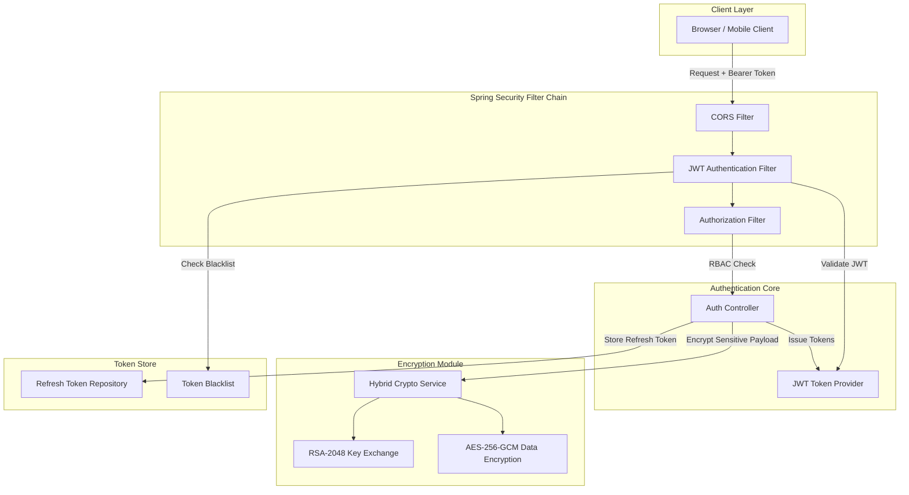

<div align="center">


<h3>🔐 Enterprise-grade Authentication, Authorization, and Hybrid Encryption Core</h3>

<p>
  
  
  
  
</p>

<p>
  
  
  
</p>

</div>

---

> 금융 및 엔터프라이즈 보안 요구사항을 기준으로 설계한 인증(Authentication), 인가(Authorization), 암호화(Encryption) 레퍼런스입니다.  
> JWT Refresh Token Rotation, Redis 기반 서버 측 토큰 통제, RSA-AES 하이브리드 암호화를 통해 "왜 이 보안 구조가 필요한지"와 "어떻게 검증했는지"를 코드와 문서로 증명합니다.

---

## 📌 Problem — 왜 만들었는가

- **토큰 탈취 리스크**: 단순 JWT Access Token 방식은 토큰 탈취 시 서버에서 즉시 폐기하기 어렵습니다.
- **Refresh Token 재사용 공격**: 장기 토큰이 탈취되면 공격자가 정상 사용자처럼 토큰을 재발급받을 수 있습니다.
- **민감 데이터 보호 한계**: HTTPS만으로는 엔드포인트 탈취, 내부 프록시, 로깅 실수까지 방어하기 어렵습니다.
- **보안 설정의 재현성 부족**: CORS, CSRF, RBAC, 로그아웃 무효화 같은 정책은 코드와 테스트로 검증되어야 합니다.

이 프로젝트는 Redis 기반 Refresh Token Rotation과 Token Blacklist, Spring Security 6.x 필터 체인, RSA-2048 + AES-256-GCM 하이브리드 암호화를 통해 보안 정책을 실행 가능한 레퍼런스로 정리합니다.

## 🏗️ Architecture — 어떻게 설계했는가



## 📂 Project Structure

```text
security-auth-core/
├── .github/workflows/ci.yml                  # ⚙️ GitHub Actions CI 파이프라인
├── src/main/java/com/hooney/lab/
│   ├── SecurityAuthCoreApplication.java       # 🚀 Spring Boot 애플리케이션 진입점
│   ├── config/
│   │   └── SecurityConfig.java                # 🛡️ Security Filter Chain, CORS, CSRF, RBAC 설정
│   └── security/                              # 🔐 인증/암호화 보안 도메인
│       ├── jwt/                               # 🔑 JWT 생성, 검증, 파싱, 인증 필터
│       │   ├── JwtTokenProvider.java          # 🔑 Access/Refresh Token 발급 및 검증
│       │   ├── JwtAuthenticationFilter.java   # 🛡️ 요청별 Bearer Token 인증 필터
│       │   └── JwtProperties.java             # ⚙️ JWT 설정 바인딩
│       ├── crypto/                            # 🔐 RSA-AES 하이브리드 암호화 모듈
│       │   ├── HybridCryptoService.java       # 🔐 RSA 키 교환 + AES-GCM 암복호화
│       │   └── CryptoProperties.java          # ⚙️ 암호화 키/알고리즘 설정
│       └── redis/                             # 📦 서버 측 토큰 상태 저장소
│           ├── RefreshTokenRepository.java    # 🔄 Refresh Token 저장 및 Rotation 지원
│           └── RedisTokenBlacklist.java       # 🚫 로그아웃 Access Token blacklist
├── src/main/resources/application.yml         # ⚙️ Redis, JWT, Security 설정
├── src/test/java/com/hooney/lab/security/     # 🧪 보안 정책 검증 테스트
│   ├── jwt/JwtTokenProviderTest.java          # 🧪 JWT 위변조, 만료, 파싱 테스트
│   └── crypto/HybridCryptoServiceTest.java    # 🧪 암복호화, IV 랜덤성, 무결성 테스트
├── build.gradle                               # 🧰 Gradle 빌드 및 의존성 관리
└── settings.gradle                            # 🧰 Gradle 프로젝트 설정
```

## 🎯 Key Features & Evidence — 무엇을 증명하는가

### 1. JWT Authentication System

| Feature | Description |
| :--- | :--- |
| **Access Token** | 짧은 TTL과 HS512 서명으로 API 요청을 stateless하게 인증 |
| **Refresh Token** | Redis에 저장하여 서버 측 무효화와 세션 통제 가능 |
| **RBAC Claims** | 역할 기반 접근 제어를 토큰 클레임과 Security Filter Chain에서 검증 |
| **Token Blacklist** | 로그아웃된 Access Token을 남은 TTL 동안 차단 |

**Evidence**

- Access Token과 Refresh Token의 생성, 검증, 파싱, 만료 처리를 테스트로 검증합니다.
- 로그아웃 시 토큰을 Redis blacklist에 등록하여 재사용을 차단합니다.
- `JwtAuthenticationFilter`에서 요청마다 서명, 만료, blacklist 여부를 확인합니다.

### 2. Refresh Token Rotation

| Risk | Strategy | Evidence |
| :--- | :--- | :--- |
| 탈취 Refresh Token 재사용 | 사용된 Refresh Token 즉시 폐기 후 새 토큰 발급 | Rotation 흐름 테스트 |
| 서버 측 세션 통제 불가 | Redis 저장소에 Refresh Token 상태 보관 | `RefreshTokenRepository` |
| 로그아웃 후 재접근 | Access Token blacklist 등록 | TTL 기반 자동 정리 |

**Evidence**

- Refresh Token 사용 시 기존 토큰을 폐기하고 새 토큰을 발급하여 replay attack 가능성을 낮춥니다.
- Redis TTL을 활용해 보안성과 저장소 정리 비용을 함께 관리합니다.

### 3. Hybrid Encryption

| Feature | Description |
| :--- | :--- |
| **RSA-2048** | AES 대칭키 교환을 위한 비대칭키 암호화 |
| **AES-256-GCM** | 데이터 암호화와 무결성 검증을 동시에 수행 |
| **Random IV** | 동일 평문도 매번 다른 암호문으로 변환 |
| **OAEP Padding** | RSA padding oracle 공격 가능성을 줄이는 안전한 패딩 전략 |

**Evidence**

- RSA 키 페어 생성, 키 인코딩/디코딩, 암복호화 라운드트립을 테스트합니다.
- AES-GCM의 IV 랜덤성을 검증해 동일 평문 반복 전송 리스크를 줄입니다.
- 잘못된 키나 위변조된 암호문이 복호화되지 않는 흐름을 검증합니다.

### 4. Spring Security 6.x Integration

| Feature | Description |
| :--- | :--- |
| **Stateless Session** | 서버 세션 없이 JWT 기반 인증 유지 |
| **CORS Policy** | Security Filter Chain 레벨의 전역 CORS 정책 |
| **CSRF Decision** | Stateless API 구조에 맞춘 명시적 CSRF 정책 |
| **OAuth2/OIDC Ready** | Google, Kakao 등 외부 Provider 확장 기반 |

**Evidence**

- 필터 체인 수준에서 인증/인가 흐름을 통제합니다.
- MockMvc 기반 테스트로 인증 우회, 권한 오류, CORS 설정을 검증할 수 있는 구조를 갖춥니다.

## 🚀 Quick Start — 어떻게 실행하는가

### Docker Compose 기반 실행

```bash
git clone https://github.com/hooneyg/security-auth-core.git
cd security-auth-core

docker-compose up -d
docker-compose logs -f security-auth-core
```

## 🧪 Interactive API Scenarios — 직접 검증하기

단순한 문서 열람을 넘어, 실제 환경에서 보안 로직을 즉시 테스트해볼 수 있는 시나리오를 제공합니다.

| Test Case | Description | Run/View |
| :--- | :--- | :--- |
| **로그인 & 토큰 발급** | 자격 증명 검증 및 JWT 세트 발급 시나리오 | [Details](./docs/api-specification.md#1-사용자-로그인-및-토큰-발급-authentication) / [Payload](./examples/login-request.json) |
| **토큰 갱신 (RTR)** | Refresh Token Rotation을 통한 재사용 방어 테스트 | [Details](./docs/api-specification.md#2-토큰-갱신-및-rtr-정책-검증-token-refresh--rotation) / [Payload](./examples/token-refresh-request.json) |
| **E2EE 암호화** | RSA + AES 하이브리드 암호화 통신 검증 | [Details](./docs/api-specification.md#3-하이브리드-암호화-및-e2ee-검증-hybrid-encryption) / [Payload](./examples/encrypt-request.json) |
| **위협 방어 시나리오** | 해킹 위협 모델링 기반의 실제 방어 흐름 가이드 | [Full Scenarios](./docs/api-scenarios.md) |

> 💡 **Pro Tip**: IntelliJ나 VSCode를 사용 중이라면 [scenarios.http](./examples/scenarios.http) 파일을 열어 버튼 클릭 한 번으로 모든 테스트를 직접 실행할 수 있습니다.

## 🧪 Tests — 어떻게 검증했는가

```bash
./gradlew test
```

| Layer | Test Target | Risk Covered |
| :--- | :--- | :--- |
| JWT Provider | 토큰 생성, 파싱, 만료, 위변조 검증 | 위조 토큰, 만료 토큰, 타입 오류 |
| Crypto Service | RSA/AES 라운드트립, IV 랜덤성 | 복호화 실패, 무결성 훼손, IV 재사용 |
| Security Chain | Filter Chain, RBAC, CORS | 인증 우회, 권한 누락, 브라우저 요청 차단 |
| Redis Token Store | Refresh Token 저장, blacklist TTL | 로그아웃 후 재사용, 저장소 누수 |

## 🧭 Roadmap

- [ ] OAuth2/OIDC provider integration
- [ ] Key rotation strategy
- [ ] Refresh token reuse detection 고도화
- [ ] Audit log masking
- [ ] Rate limiting
- [ ] API Gateway 연동 보안 정책

## 🔗 Related Labs

| Related Lab | 연결 이유 |
| :--- | :--- |
| `infra-master-lab` | 보안 코어를 운영 환경에 배포하기 위한 인프라 기준 |
| `database-master-lab` | 사용자, 세션, 감사 로그 저장과 조회 최적화 기준 |
| `event-streaming-lab` | 보안 이벤트, 감사 로그, 알림을 비동기로 전파 |
| `realtime-comm-lab` | WebSocket/WebRTC 연결 인증 기준 |
| `ai-agent-brain-lab` | 보안 문서 기반 AI 질의와 자동화 확장 기준 |

## 📚 Documentation

- [Architecture Overview](./docs/architecture.md)
- [ADR-001: JWT 서명 알고리즘 선택](./docs/decisions/ADR-001-jwt-signature.md)
- [ADR-002: 하이브리드 암호화 전략 선택](./docs/decisions/ADR-002-hybrid-encryption.md)
- [Troubleshooting & Debugging](./docs/troubleshooting.md)

## 📄 License

This project is licensed under the [MIT License](./LICENSE).

---

<div align="center">
<b>Built by <a href="https://github.com/hooneyg">Hooney</a> — AI FullStack Developer & Enterprise Solution Architect</b>


</div>
