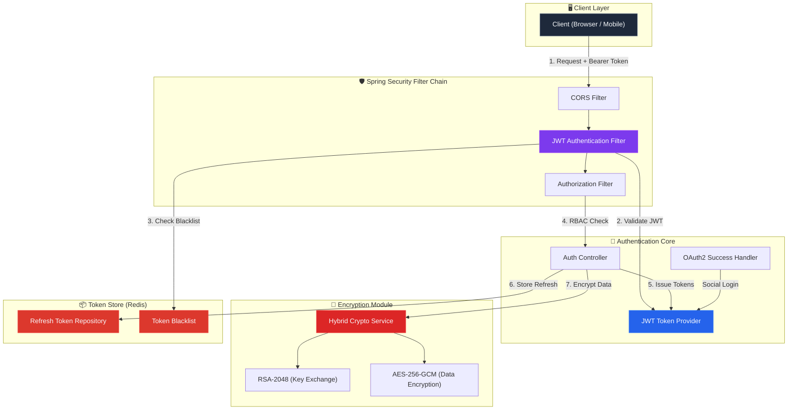

<div align="center">


<h3>🔐 Enterprise-grade Security, JWT, and Hybrid Encryption Core</h3>

<p>
  
  
  
  
</p>

<p>
  
  
  
</p>

</div>

---

> 금융 및 엔터프라이즈 급 보안 표준을 준수하는 **인증(Authentication) & 암호화(Encryption)** 기술의 집약체입니다.  
> 모든 코드에는 **한 줄 한 줄 상세한 한글 주석**이 포함되어 있어, 누구나 보안 아키텍처의 내부 동작을 이해할 수 있습니다.

---

## 🏗️ System Architecture



---

## 📂 Project Structure

```
security-auth-core/
├── .github/workflows/ci.yml          # GitHub Actions CI 파이프라인
├── src/
│   ├── main/
│   │   ├── java/com/hooney/lab/
│   │   │   ├── SecurityAuthCoreApplication.java   # 메인 엔트리 포인트
│   │   │   ├── config/
│   │   │   │   └── SecurityConfig.java            # 🛡️ Spring Security 필터 체인
│   │   │   └── security/
│   │   │       ├── jwt/
│   │   │       │   ├── JwtTokenProvider.java       # 🔑 토큰 생성/검증/파싱
│   │   │       │   ├── JwtAuthenticationFilter.java # 🛡️ JWT 인증 필터
│   │   │       │   └── JwtProperties.java          # ⚙️ JWT 설정 바인딩
│   │   │       ├── crypto/
│   │   │       │   ├── HybridCryptoService.java    # 🔐 RSA+AES 하이브리드 암호화
│   │   │       │   └── CryptoProperties.java       # ⚙️ 암호화 설정 바인딩
│   │   │       └── redis/
│   │   │           ├── RefreshTokenRepository.java  # 📦 Refresh Token 저장소
│   │   │           └── RedisTokenBlacklist.java     # 🚫 토큰 블랙리스트
│   │   └── resources/
│   │       └── application.yml                      # 📋 전체 설정 (상세 주석)
│   └── test/
│       └── java/com/hooney/lab/security/
│           ├── jwt/
│           │   └── JwtTokenProviderTest.java        # 🧪 JWT 10개 테스트
│           └── crypto/
│               └── HybridCryptoServiceTest.java     # 🧪 암호화 7개 테스트
├── build.gradle                                      # Gradle 빌드 (상세 주석)
└── settings.gradle
```

---

## 🎯 Key Features

### 1. 🔑 JWT Authentication System
| Feature | Description |
| :--- | :--- |
| **Access Token** | 15분 유효, HMAC-SHA512 서명, 역할(RBAC) 클레임 포함 |
| **Refresh Token** | 7일 유효, Redis 저장, 서버 측 무효화 가능 |
| **RTR (Refresh Token Rotation)** | 토큰 사용 시 자동 갱신 → 탈취된 토큰 즉시 무효화 |
| **Token Blacklist** | 로그아웃 시 Redis에 등록, TTL 기반 자동 정리 |

### 2. 🔐 Hybrid Encryption (RSA + AES-256-GCM)
| Feature | Description |
| :--- | :--- |
| **RSA-2048** | 비대칭키 암호화 — AES 키를 안전하게 전달 |
| **AES-256-GCM** | 대칭키 암호화 — 데이터 암호화 + 무결성 검증 동시 수행 |
| **IV Randomization** | 동일 평문 → 매번 다른 암호문 (Rainbow Table 방어) |
| **OAEP Padding** | RSA Padding Oracle Attack 방어 |

### 3. 🛡️ Spring Security 6.x Integration
| Feature | Description |
| :--- | :--- |
| **Stateless Session** | JWT 기반, 서버 측 세션 미사용 |
| **RBAC** | URL 패턴별 역할 기반 접근 제어 |
| **OAuth2/OIDC** | Google, Kakao 소셜 로그인 연동 |
| **BCrypt** | 비밀번호 해싱 (Salt 내장, 적응형 함수) |

---

## 🧪 Test Coverage

```
✅ JwtTokenProviderTest (10 tests)
   ├── Access Token 생성 검증
   ├── Refresh Token 생성 검증
   ├── 토큰 유효성 검증 (정상)
   ├── 위변조 토큰 거부
   ├── 만료된 토큰 거부
   ├── 사용자 ID 추출
   ├── 토큰 타입 추출
   ├── Authentication 객체 생성
   ├── 남은 유효 시간 계산
   └── 빈/null 토큰 거부

✅ HybridCryptoServiceTest (7 tests)
   ├── RSA 키 페어 생성
   ├── 키 인코딩/디코딩 라운드트립
   ├── 암복호화 라운드트립
   ├── 대용량 데이터 처리
   ├── 잘못된 키 복호화 거부
   ├── IV 랜덤성 검증
   └── 빈 문자열 처리
```

---

## ⚡ Quick Start

### Prerequisites
- Java 21+ (LTS)
- Gradle 8.x
- Redis Server (Token Store용)

### 1. Clone & Build
```bash
git clone https://github.com/hooneyg/security-auth-core.git
cd security-auth-core

# 빌드 & 테스트 실행
./gradlew build test
```

### 2. Configuration
`application.yml`에서 아래 플레이스홀더를 실제 값으로 교체하세요:

```yaml
jwt:
  secret: "[USER_JWT_SECRET_KEY_MIN_64_CHARS]"  # openssl rand -base64 64

spring:
  data:
    redis:
      host: "[USER_REDIS_HOST]"
      password: "[USER_REDIS_PASSWORD]"

  security:
    oauth2:
      client:
        registration:
          google:
            client-id: "[USER_GOOGLE_CLIENT_ID]"
            client-secret: "[USER_GOOGLE_CLIENT_SECRET]"
```

### 3. Run
```bash
./gradlew bootRun
```

---

## 🔗 Related Labs

| Lab | Relevance |
| :--- | :--- |
| 🗄️ [**database-master-lab**](https://github.com/hooneyg/database-master-lab) | Redis 기반 토큰 저장소 설계 패턴 연동 |
| 🌊 [**event-streaming-lab**](https://github.com/hooneyg/event-streaming-lab) | 인증 이벤트의 Kafka 스트리밍 처리 |
| 🏗️ [**infra-master-lab**](https://github.com/hooneyg/infra-master-lab) | K8S 환경에서의 Secret 관리 및 배포 전략 |

---

<div align="center">

**Built with ❤️ by [Hooney](https://github.com/hooneyg) — AI FullStack Developer & Enterprise Solution Architect**


</div>