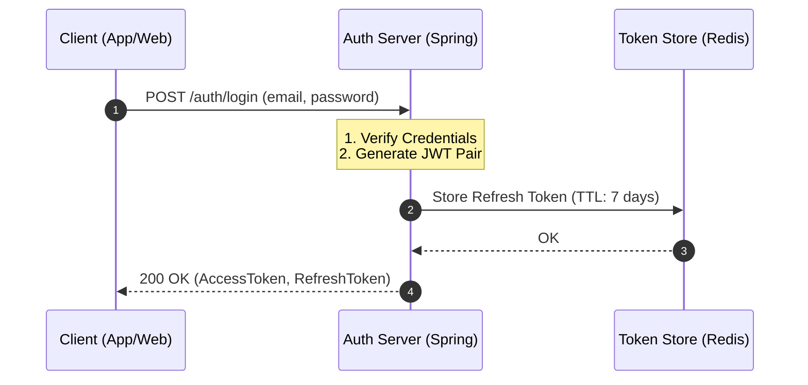
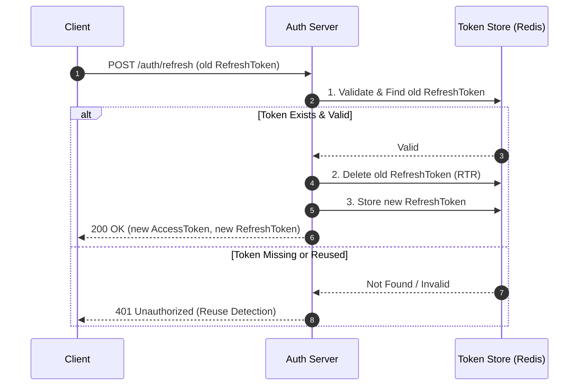
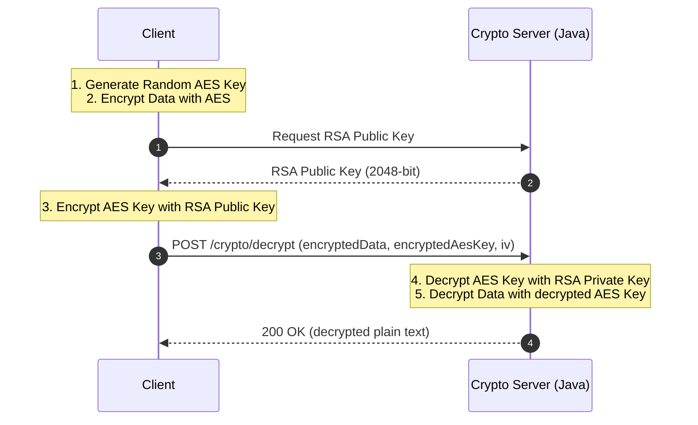

# 📋 API 통합 테스트 명세서 및 시나리오 가이드

본 문서는 `security-auth-core` 프로젝트의 핵심 보안 기능(인증, 인가, 암호화)을 검증하기 위한 API 명세와 상세 테스트 시나리오를 제공합니다.

---

## 🛠️ API 기반 정보
- **Base URL**: `http://localhost:8080/api/v1`
- **Content-Type**: `application/json`
- **Auth Method**: `Bearer Token (JWT)`

---

## 🎭 핵심 테스트 시나리오

### 1. 사용자 로그인 및 토큰 발급 (Authentication)
사용자의 자격 증명을 확인하고 세션 유지를 위한 이중 토큰(Access, Refresh)을 발급받는 단계입니다.

#### [Flow Diagram]



| 항목 | 내용 |
| :--- | :--- |
| **Scenario ID** | AUTH-TC-001 |
| **목표** | 정상적인 로그인 흐름 및 토큰 발급 검증 |
| **전제 조건** | Redis 서버가 실행 중이어야 함 |
| **API 경로** | `POST /auth/login` |
| **보안 포인트** | 비밀번호 평문 노출 방지, 발급된 Refresh Token의 Redis 저장 여부 확인 |
| **실패 시나리오** | 1. 존재하지 않는 이메일 (401)<br>2. 잘못된 비밀번호 (401)<br>3. 필수 필드 누락 (400) |

**Request Body**
```json
{
  "email": "admin@hooneyz.com",
  "password": "SecurePassword123!"
}
```

**Expected Response (200 OK)**
```json
{
  "accessToken": "eyJhbGci...", 
  "refreshToken": "eyJhbGci...",
  "tokenType": "Bearer",
  "expiresIn": 3600
}
```

---

### 2. 토큰 갱신 및 RTR 정책 검증 (Token Refresh & Rotation)
보안 강화를 위해 한 번 사용된 Refresh Token은 폐기되고 새로운 토큰 세트가 발급되는지 검증합니다.

#### [Flow Diagram]



| 항목 | 내용 |
| :--- | :--- |
| **Scenario ID** | AUTH-TC-002 |
| **목표** | Refresh Token Rotation(RTR) 정책 및 Replay Attack 방어 검증 |
| **단계** | 1. 발급받은 Refresh Token으로 `/auth/refresh` 호출<br>2. 동일한 토큰으로 **다시 한번** 호출 시도 |
| **기대 결과** | 1차 호출: 성공(200 OK) 및 새 토큰 발급<br>2차 호출: 실패(401 Unauthorized) |
| **보안 포인트** | 사용된 토큰은 즉시 무효화되어야 하며, 탈취된 토큰의 재사용 시도를 원천 차단함 |
| **실패 시나리오** | 1. 만료된 Refresh Token 사용 (401)<br>2. 이미 사용된(무효화된) Token 재사용 시도 (401) |

**Request Body**
```json
{
  "refreshToken": "previous_issued_refresh_token_string"
}
```

---

### 3. 하이브리드 암호화 및 E2EE 검증 (Hybrid Encryption)
클라이언트 측 암호화를 시뮬레이션하여, 서버에서 개인키로 복호화가 정상적으로 이루어지는지 확인합니다.

#### [Flow Diagram]



| 항목 | 내용 |
| :--- | :--- |
| **Scenario ID** | CRYPTO-TC-001 |
| **목표** | RSA-2048 공개키 기반 AES 키 교환 및 데이터 복호화 무결성 검증 |
| **전제 조건** | 서버의 RSA Public Key를 미리 획득한 상태 |
| **API 경로** | `POST /crypto/decrypt` |
| **보안 포인트** | 중간자(MitM)가 데이터를 탈취해도 Private Key 없이는 내용을 볼 수 없음을 증명 |
| **실패 시나리오** | 1. 위조된 RSA 키로 암호화된 AES 키 전달 (400/500)<br>2. 변조된 암호문(IV 불일치 등) 전달 (400) |

**Request Body (Encrypted)**
```json
{
  "encryptedData": "AES로 암호화된 본문 데이터",
  "encryptedAesKey": "RSA 공개키로 암호화된 AES 키",
  "iv": "AES 암호화에 사용된 초기화 벡터"
}
```

---

## 🚫 에러 코드 및 상세 대응 가이드

| HTTP Status | Error Code | 메시지 예시 | 발생 원인 | 대응 방안 |
| :--- | :--- | :--- | :--- | :--- |
| **400** | `BAD_REQUEST` | `Required field missing` | 요청 파라미터 누락 또는 형식 오류 | API 명세서의 필드 제약 조건 확인 |
| **401** | `UNAUTHORIZED` | `Invalid credentials` | 이메일/비밀번호 불일치 | 자격 증명 재확인 |
| **401** | `TOKEN_EXPIRED` | `Token has expired` | 액세스 토큰 만료 | Refresh API를 통한 토큰 갱신 필요 |
| **401** | `REUSE_DETECTED` | `Token already used` | 이미 사용된 Refresh Token 감지 | 보안 침해 의심: 강제 로그아웃 및 재로그인 |
| **403** | `FORBIDDEN` | `Access Denied` | 권한(Role) 부족 | 계정 권한 설정 확인 (USER/ADMIN) |
| **429** | `TOO_MANY_REQ` | `Rate limit exceeded` | 과도한 요청 발생 | API 호출 주기 조절 (Rate Limiting) |

---

## 🧪 테스트 실행 도구 및 방법

본 시나리오는 다음 도구들을 통해 엔터프라이즈 레벨의 검증이 가능합니다.

1.  **REST Client (IDE 추천)**: `examples/scenarios.http` 파일을 활용하세요. (가장 직관적이고 빠름)
2.  **CURL**: `examples/` 폴더의 JSON 파일들을 `--data @filename.json` 옵션으로 호출할 수 있습니다.
3.  **Postman**: `src/main/resources/api-spec.yaml` (OpenAPI)가 준비되어 있다면 임포트하여 사용 가능합니다.

---

## 🛡️ 보안 검증 체크리스트 (Security Verification)

- [ ] 모든 API 통신은 HTTPS 상에서 이루어지는가?
- [ ] Access Token의 만료 시간은 적절하게 짧은가? (예: 15~30분)
- [ ] Refresh Token 사용 시 즉시 Rotation이 발생하는가?
- [ ] 암호화 시 GCM 모드와 랜덤 IV를 사용하여 무결성을 보장하는가?
- [ ] 에러 메시지에 시스템 내부 정보(Stack Trace 등)가 유출되지 않는가?
