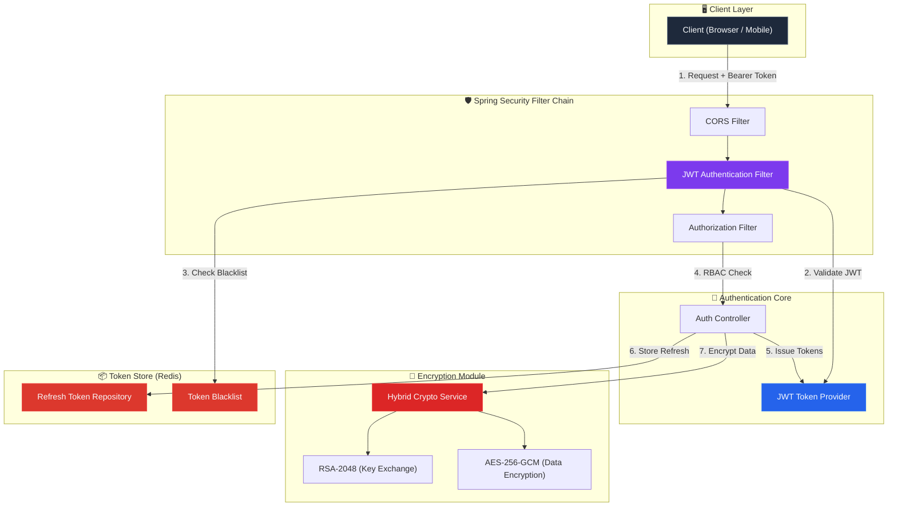
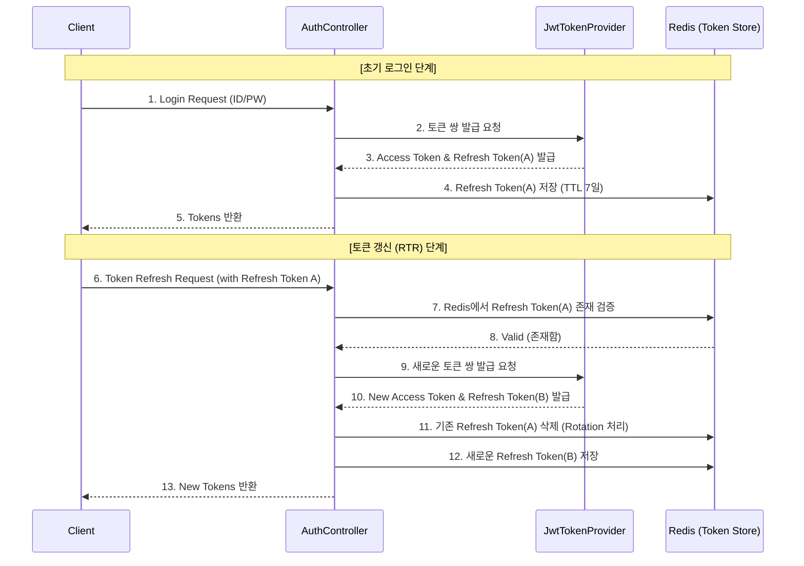
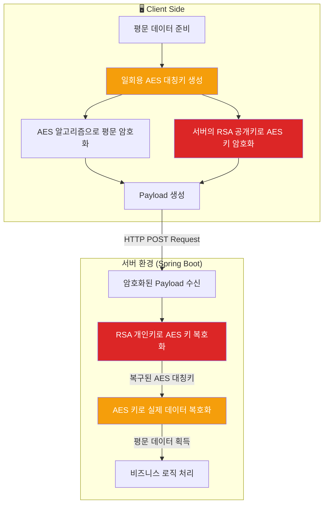
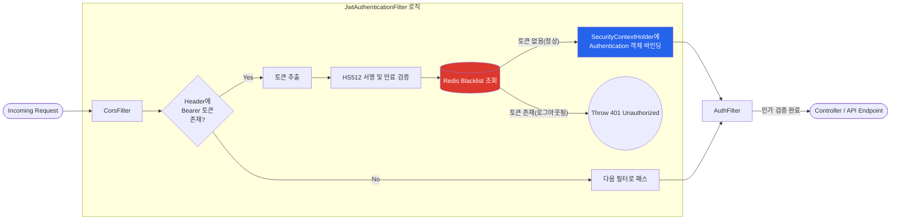

# 🏛️ Security Auth Core Architecture

이 문서는 `security-auth-core` 프로젝트의 핵심 아키텍처 및 세부 도메인별 시스템 흐름을 설명합니다.

---

## 1. System Context Diagram (전체 조감도)
애플리케이션 전체의 구조와 컴포넌트 간의 상호작용을 나타냅니다.

---

## 2. 세부 도메인 아키텍처

### 2.1 🔄 JWT & Refresh Token Rotation (RTR) Sequence
토큰 탈취(Replay Attack)를 방지하기 위해, Refresh Token 사용 시 기존 토큰을 즉시 폐기하고 새로운 토큰 쌍을 발급하는 회전(Rotation) 로직의 시퀀스입니다.

### 2.2 🔐 Hybrid Encryption Data Flow
민감 데이터 교환 시 RSA의 키 교환 능력과 AES-GCM의 빠른 처리 속도를 결합한 하이브리드 암호화 파이프라인입니다. 매 요청마다 IV를 랜덤하게 생성하여 전방향 안전성(Perfect Forward Secrecy)을 보장합니다.

### 2.3 🛡️ Spring Security Filter Chain Pipeline
모든 클라이언트 요청이 비즈니스 로직에 도달하기 전 거치는 보안 검문소(Filter)의 내부 처리 파이프라인입니다.

